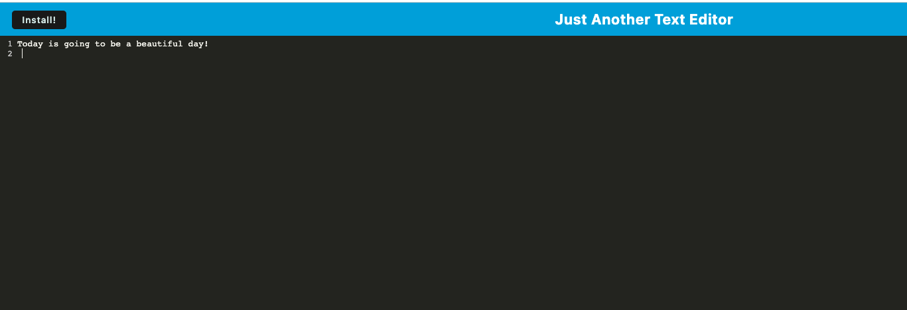

# <A-Text-Editor>

## Description
 It is a single-page application: text editor that runs in the browser and functions offline.

- My motivation was to create a text editor application that runs offline and to practice PWA.

- I like an ability to be able to open a computer and be able to start typing something one wishes to type including a planning, scheduling, writing a poem, or a New Year resolution., most importantly it can be done offline. 

- It solve a simple but sometimes important issue -- an ability to use a text editor offline. For example, not all airlines provide a wifi or not everyone can afford it, this application is simple to use, however, it provides aplatform where a user can limitlessly express their thoughts or type in something important being offline. 

- I learned how to apply PWA in my application. PWA bundles into a single file which improves efficiency and performance of the application. I learned IndexedDB storage, Server Worker, and cashing strategies so an application can work offline. 

Github link: https://github.com/catpolk/a-text-editor
Pages: https://catpolk.github.io/a-text-editor/
